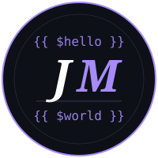

# 
### `Full Stack Developer`

*Building complete web experiences — from pixel-perfect UIs to solid, scalable backends.*

---

## 🧑‍💻 About Me

| | |
|:---:|:---|
| ⚡ | Full Stack developer — I own the whole product, from UI to database |
| 🎨 | Building interfaces with **React**, **Vue**, **Tailwind** and **Blade** |
| ⚙️ | Powering backends with **Laravel**, **PHP** and **Node.js** |
| 🗄️ | Designing schemas and queries in **PostgreSQL**, MySQL and MongoDB |
| 🐧 | Living in **WSL** — Linux workflow, Windows machine |
| 🤝 | Open source enthusiast — I believe in sharing knowledge and collaborating |

---

## 🛠️ Tech Stack

**⚡ Frontend**

**⚙️ Backend**

**🗄️ Database & ORM**

**🔧 Tools & Workflow**

**🤖 AI & Assistants**

---

## 📊 GitHub Stats

---

✦ *Si alguno de mis proyectos te sirve, una estrella siempre se agradece* ✦

